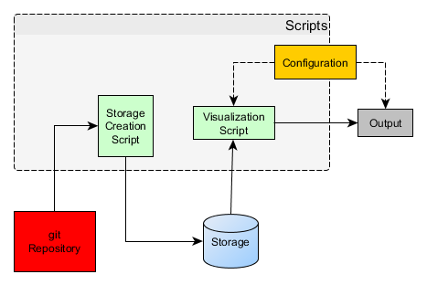
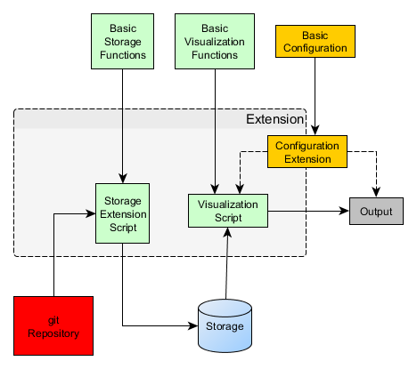

Building the architecture which meets the requirements
======================================================

Where do we start? The first try of a design fulfilling some of the architectural requirements
could look like visualized in **Figure 1**. A script will read out the git information and
put it into a persistent storage. This storage will be read out from a script generating the
visualization with respect to some configuration options.

    
    **Figure 1:** Basic architecture for gitexplorer.

However if we think about supporting the extensibility requirement, it is clear
that this architecture can be improved. 

    
    **Figure 2:** Architecture for gitexplorer having extensibility as a basic design element.

.. code-block:: javascript

    {"commit_hash": <commit_hash>,
     "author": <name>,
     "mail": <mail>,
     "date": <date>,
     "details": {
         "create": [{
             "file_path": <file_path>,
             "permission": <unix_file_permission>,
             "extension": <.extension>}],
         "delete": [{
             "file_path": <file_path>,
             "permission": <unix_file_permission>}],
         "rename": [{
             "new_path": <file_path>,
             "extension": <.extension>,
             "old_path": <file_path>,
             "match": <match_percentage>}],
         "change": {
             <file_path>: {
                 "old_permission": <unix_file_permission>,
                 "new_permission": <unix_file_permission>}},
         "modifications": [{
             "file_path": <file_path>,
             "additions": <#additions>,
             "deletions": <#deletions>}]}}
